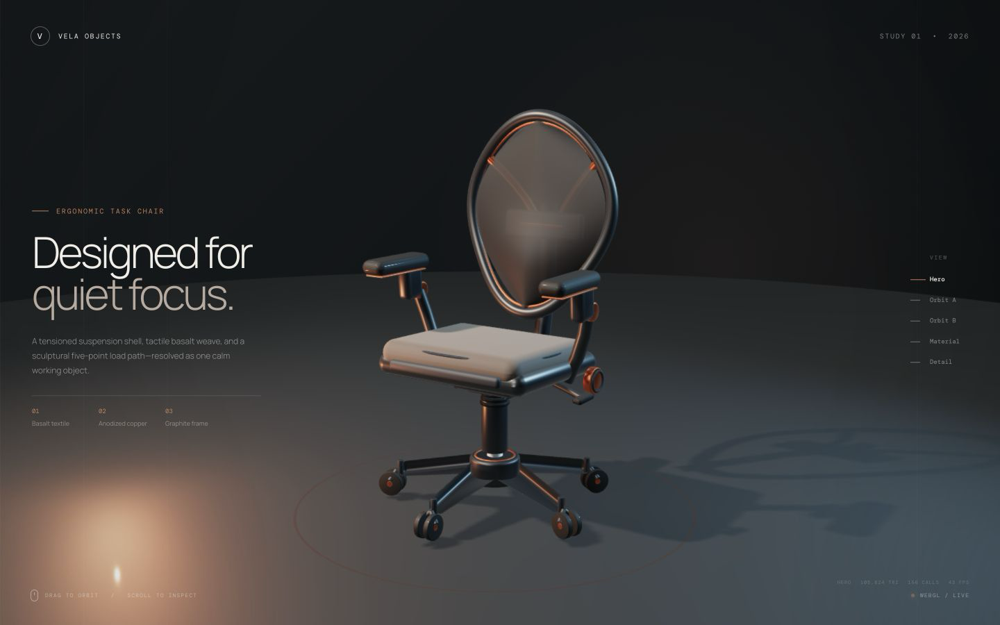
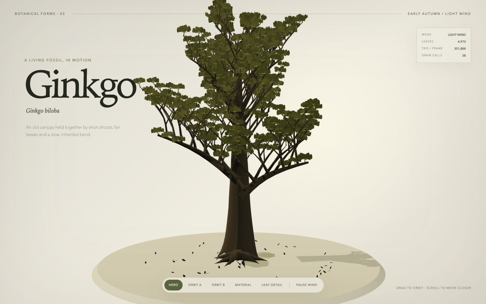
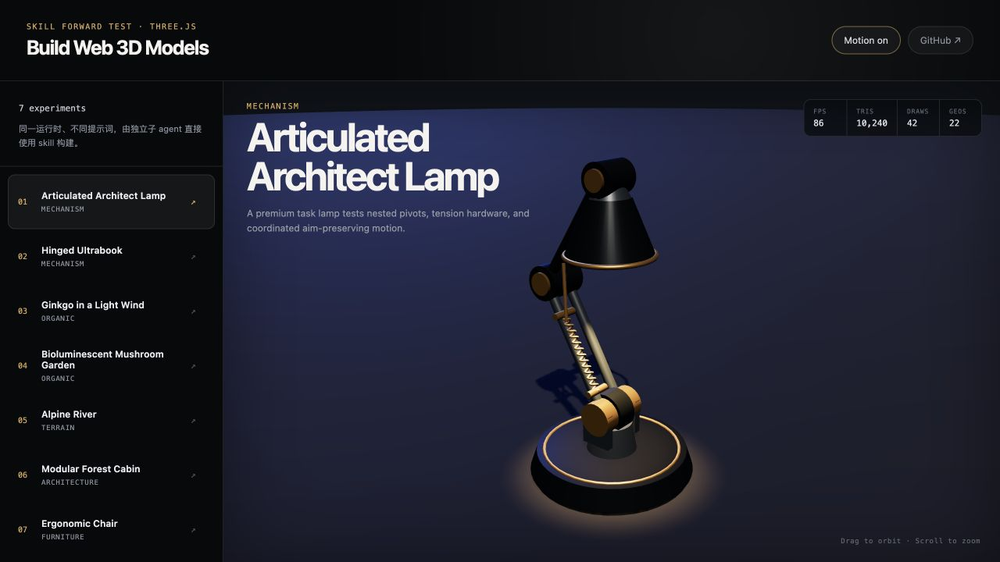
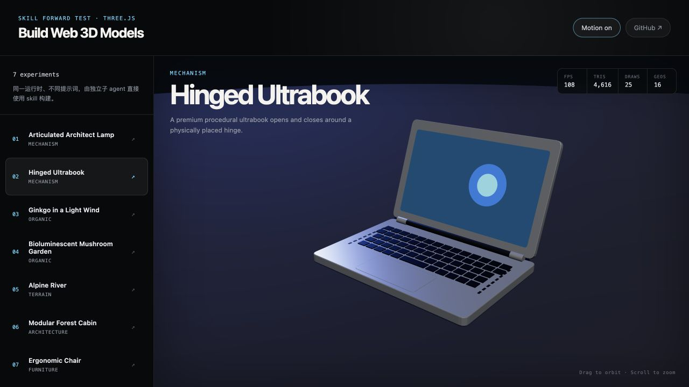
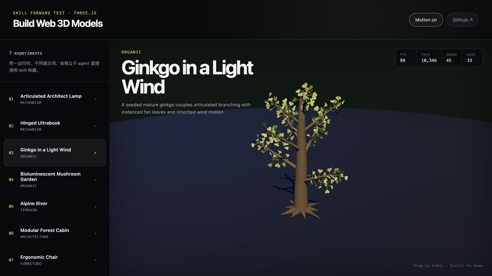
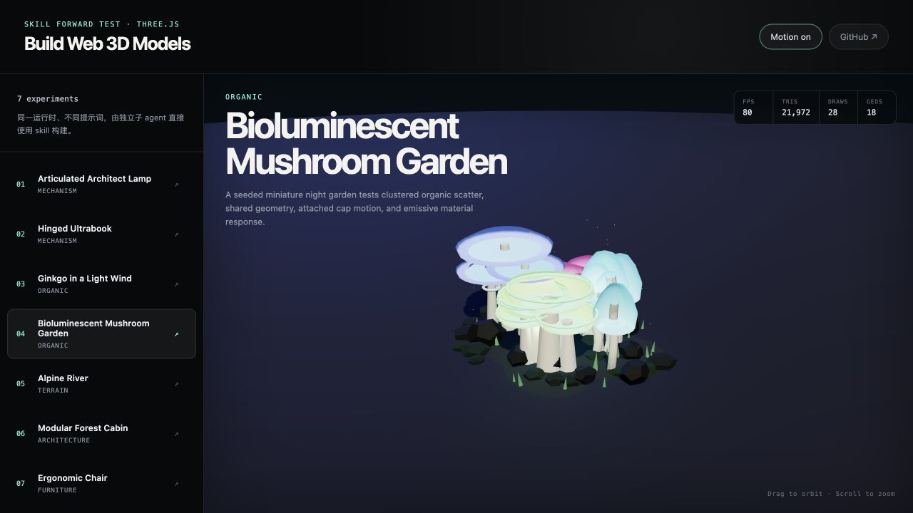
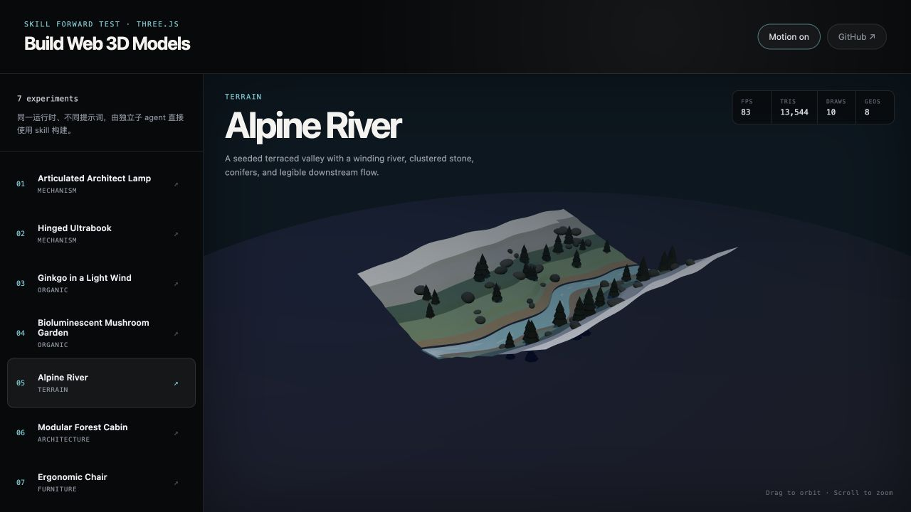
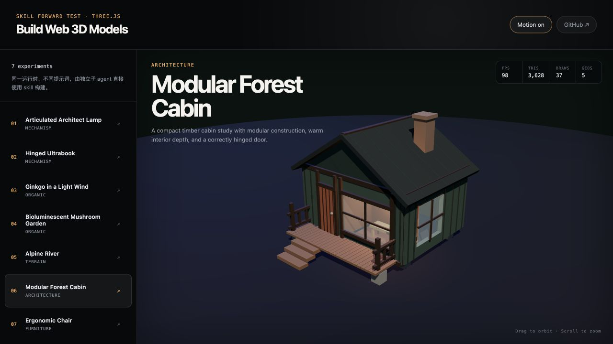
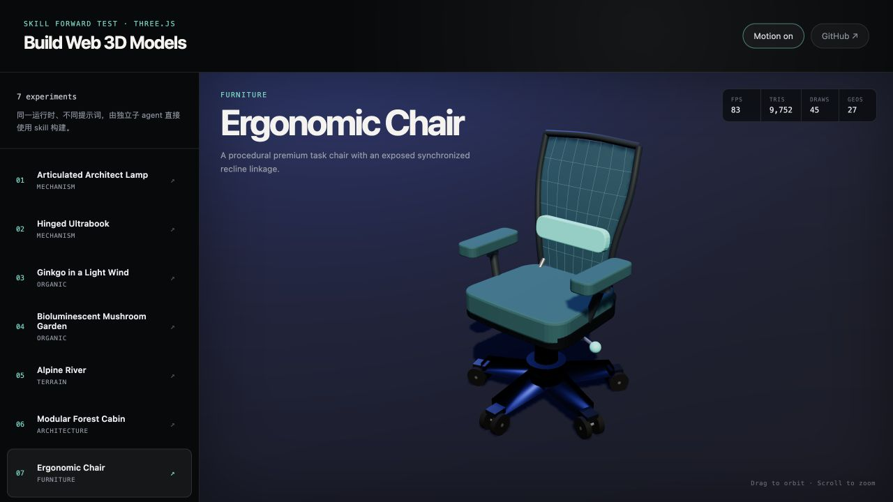

# build-web-3d-models

面向 Web 的 3D 资产与场景构建 Codex skill：从视觉目标、尺度和身份特征开始，把建模、PBR、运动层级、Three.js 集成、资产级截图评审、独立盲评与性能验收放在同一条可复现工作流中。

[查看 skill](SKILL.md) · [视觉质量流程](references/visual-quality-workflow.md) · [质量优先子 agent 提示词](references/quality-first-agent-prompt.md) · [证据校验器](scripts/validate_visual_evidence.py)



## 测试结论

仓库现在保留两层测试，目的不同：

1. **7 个工程基线 Demo**验证层级、pivot、程序化构造、instancing、预算和浏览器运行，但视觉上只应视为 blockout/技术样例。
2. **2 个质量前向测试**要求视觉目标板、身份特征清单、至少两轮像素评审、五张固定证据、精确文件哈希和独立盲评。它们明显优于旧基线，但都被盲评诚实判定为 `partial`，没有伪装成完成品。

| 题目 | 旧基线盲评 | v2 builder 自评 | v2 独立盲评 | 净提升 | 最终状态 |
| --- | ---: | ---: | ---: | ---: | --- |
| Ergonomic Chair | 37 | 85 | **73** | **+36** | partial |
| Ginkgo in Light Wind | 33 | 78 | **56** | **+23** | partial |

净提升以历史 blockout 盲评分为基线；椅子最终 73 分来自 UI-free 精确文件复评，银杏 33→56 来自同一轮 A/B 盲评。分数差揭示了一个关键问题：自评很容易把“功能存在、页面好看”误判成“资产完成”。现在完成状态由独立 critic 的较低分数/状态决定；最终截图发生任何像素变化后，旧评审自动失效，必须重新绑定哈希并复评。

<table>
  <tr>
    <td width="50%">
      
      <br /><strong><a href="quality-forward-tests/chair-v2/">Chair v2</a> · 73/100 · partial</strong>
      <br />Blender + GLB + Three.js 混合流程；CMF、原创轮廓和网页 hero 成立，座底—背架—气柱承力闭环、脚轮连接和交互证据仍不足。
    </td>
    <td width="50%">
      
      <br /><strong><a href="quality-forward-tests/ginkgo-v2/">Ginkgo v2</a> · 56/100 · partial</strong>
      <br />程序化 Three.js；叶片识别和编辑式展示提升明显，树枝 lattice、重复冠层 pad、根部接地和风动时序证据仍不足。
    </td>
  </tr>
</table>

完整证据见 [quality-forward-tests](quality-forward-tests/README.md)。椅子以[精确五图盲评](quality-forward-tests/chair-v2/independent-critic-exact.md)为最终结论；银杏的[独立 A/B 盲评](quality-forward-tests/ginkgo-v2/independent-critic.md)同时记录了基线与 v2 的差异。

## 7 个独立子 agent 工程基线

每个 Demo 由独立子 agent 使用相同任务框架生成，只更换对象题目；它们共享同一 Three.js 运行时和验收契约。以下数据来自 1280×720 真实 WebGL 页面，包含共享地面和阴影 pass。FPS 是单机诊断值，不是跨设备承诺。

| Demo | 主要验证能力 | Tris | Draws | FPS | Console |
| --- | --- | ---: | ---: | ---: | ---: |
| Articulated Architect Lamp | 三关节层级、拉簧/连杆、灯头补偿 | 10,240 | 42 | 85 | 0 |
| Hinged Ultrabook | 物理铰轴、开合端点、完整盖板层级 | 4,616 | 25 | 108 | 0 |
| Ginkgo in a Light Wind | 层级枝干、233 片实例叶、父子风动 | 10,346 | 45 | 89 | 0 |
| Bioluminescent Mushroom Garden | 四种原型、聚簇散布、实例与发光材质 | 21,972 | 28 | 78 | 0 |
| Alpine River | 程序化地形、水道、岩石与针叶树实例 | 13,544 | 10 | 80 | 0 |
| Modular Forest Cabin | 模块化构造、真实洞口、室内纵深、门铰链 | 3,628 | 37 | 96 | 0 |
| Ergonomic Chair | 五星脚、双轮脚轮、网背、同步倾仰连杆 | 9,752 | 45 | 83 | 0 |

<table>
  <tr>
    <td width="50%"><br /><strong>01 · Articulated Lamp</strong></td>
    <td width="50%"><br /><strong>02 · Hinged Ultrabook</strong></td>
  </tr>
  <tr>
    <td width="50%"><br /><strong>03 · Ginkgo Wind</strong></td>
    <td width="50%"><br /><strong>04 · Mushroom Garden</strong></td>
  </tr>
  <tr>
    <td width="50%"><br /><strong>05 · Alpine River</strong></td>
    <td width="50%"><br /><strong>06 · Modular Cabin</strong></td>
  </tr>
  <tr>
    <td colspan="2"><br /><strong>07 · Ergonomic Chair</strong></td>
  </tr>
</table>

## 本地运行

```bash
git clone git@github.com:giraffe-tree/build-web-3d-models.git
cd build-web-3d-models

# 7 个工程基线，同一网页切换
cd showcase
npm install
npm run dev -- --host 127.0.0.1 --port 4210
```

质量 v2 是两个独立网页：

```bash
# 以下均从仓库根目录运行

# 终端 A：椅子
(cd quality-forward-tests/chair-v2 && npm install && npm run dev -- --port 4321)

# 终端 B：银杏
(cd quality-forward-tests/ginkgo-v2 && npm install && npm run dev -- --port 4317)
```

椅子支持 `?view=hero|orbitA|orbitB|neutralMaterial|subjectProof`；追加 `&capture=1` 可进入无 UI、固定相机的资产评审模式。银杏页面提供对应固定视图、静止/风动状态和 capture 模式。

## 验证

```bash
python3 /Users/giraffetree/.codex/skills/.system/skill-creator/scripts/quick_validate.py .
python3 scripts/validate_visual_evidence.py --self-test
python3 scripts/validate_visual_evidence.py quality-forward-tests/chair-v2/quality-evidence.json
python3 scripts/validate_visual_evidence.py quality-forward-tests/ginkgo-v2/quality-evidence.json

cd showcase && npm run test:demos && npm run build
cd ../quality-forward-tests/chair-v2 && npm run build
cd ../ginkgo-v2 && npm run check && npm run build
```

## 这轮失败如何改变了 skill

- 不再用“程序化几何、零纹理、统一 80k/45 预算”作为所有题目的默认答案；先根据画面占比、最近观察距离、复用数量和交互风险选择 Blender、程序化或混合流程，再推导预算。
- polished 原创资产即使用户没有给参考，也先建立 3–8 张视觉目标板，明确采用/拒绝的形体、构造、材质与光照特征。
- `hero` 可以证明真实页面；`orbitA`、`orbitB`、`neutralMaterial` 和 `subjectProof` 必须是无 UI 资产证据。subject proof 必须在像素里真正隔离关键特征，文件名和说明文字不算证明。
- 每轮先找像素中影响最大的 3 个缺陷，只做最高价值修复；至少两轮。性能优化放到视觉 floor 之后，避免把 blockout 优化成更快的 blockout。
- schema v2 校验真实 PNG 结构、尺寸、非重复像素、相机方向、语义状态、固定时间、最终文件 SHA-256、评审哈希和 critic 哈希。critic 的较低状态具有最终完成权。

## 本轮优化：把事后缺陷变成开工前决策

盲评失分集中在 motion/interaction、construction/attachment、material 和有机形态四处。本轮把这些事后缺陷变成开工前的强制结构决策：

- 运动证据标准：motion/interaction 声明必须附 motionEvidence——固定相机与固定时间参数下捕获的连续帧；静帧不再算交互证据。
- 连接词表：连接/装配必须从 joint vocabulary 中声明关节类型与承力路径；“相切+变色”不再算连接证据。
- 母版优先（master-sample-first）：重复或层级化的有机结构先做出并通过一个母版样本（枝干模块、冠层单元、重复零件），再实例化或复制，避免格子枝和垫片冠。
- 每轮 fresh-eyes 评审：每轮评审由不带前轮上下文的新 reviewer 执行；builder 自评不作为完成依据。
- scan PBR 决策规则：材质关键且会被近距离观察的 micro band 使用扫描 PBR 贴图（`scripts/fetch_pbr.py` 获取）；程序化 micro 材质叙事封顶约 80 分。
- 确定性脚本：`scripts/capture_views.mjs` 做固定视图与连续帧的确定性捕获，`scripts/score_silhouette.py` 做剪影指标诊断（诊断用途，不是硬性门槛）。

## 已知边界

- v2 两个资产都只是 `partial`。仓库保留它们是为了展示改进幅度、失败模式和可审计流程，不是把 56/73 分作品当成质量天花板。
- 静态 PNG 能证明多角度和固定语义状态，不能证明拖拽连续性或风动的相位/阻尼；完整运动证据仍需要短录屏或受控连续帧。
- 7 个基线 Demo 仍适合做工程回归，但不应继续作为 polished 视觉质量的正例。

## 仓库结构

```text
SKILL.md                                  skill 主流程
references/visual-quality-workflow.md    视觉目标、评审与完成门槛
references/quality-first-agent-prompt.md 子 agent 默认质量提示词
scripts/audit_gltf.py                    glTF/GLB 可复现审计
scripts/validate_visual_evidence.py      schema v1/v2 证据校验
scripts/capture_views.mjs                固定视图与连续帧确定性捕获
scripts/score_silhouette.py              剪影指标诊断（格子枝/重复冠层）
scripts/fetch_pbr.py                     获取授权扫描 PBR 材质
showcase/                                7 个工程基线 Demo
quality-forward-tests/chair-v2/          Blender/GLB/Three.js 质量测试
quality-forward-tests/ginkgo-v2/         程序化 Three.js 质量测试
```
